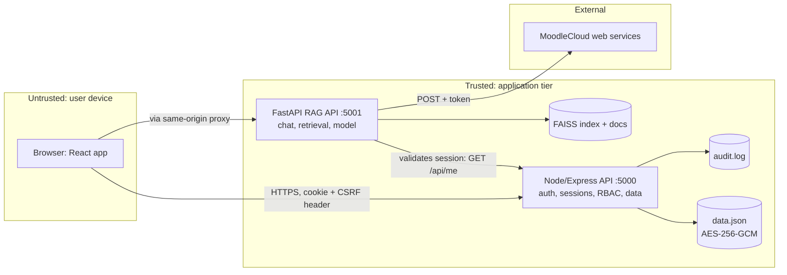

# Phase 2: Threat model (condensed)

## Architecture and trust boundaries

Trust boundaries: (1) browser to server, (2) Node to FastAPI (service-to-service), (3) application to Moodle.
Entry points: login, activation, 2FA, all `/api/*` routes, chat input, Moodle content ingested into the index.

## STRIDE analysis (risk = likelihood x impact, each 1-5)
| # | Threat | STRIDE | L | I | Risk | Mitigation (requirement) | Test |
|---|---|---|---|---|---|---|---|
| T1 | Unauthenticated access to student data and admin actions | E, I | 5 | 5 | 25 | Session required on every route; RBAC middleware (I3, AU1) | node: "every protected route rejects unauthenticated" |
| T2 | Role forged client-side (`localStorage.role=admin`) | E | 5 | 5 | 25 | Role only from signed server session; UI flag is cosmetic (AU1) | node: forged tokens; browser run |
| T3 | Hardcoded/default admin credentials | S | 5 | 5 | 25 | Credentials from environment; no secrets in source (C1, C5) | node: source has no `admin123` |
| T4 | Plaintext passwords stolen from data file / API | I | 4 | 5 | 20 | Argon2id; file encrypted AES-256-GCM; hashes never returned (C1, C2) | node: no plaintext at rest |
| T5 | Account takeover via open set-password flow | S, E | 5 | 4 | 20 | One-time activation code, 7-day expiry, attempt limits (AU1) | node: activation tests |
| T6 | Brute-force / credential stuffing | S, D | 5 | 4 | 20 | Lockout after 5 failures, rate limits, generic errors, TOTP (A1, AU2) | node: lockout; attack_demo T8 |
| T7 | IDOR (read other users' records via id/email parameter) | I | 4 | 4 | 16 | Identity from session; `?email=` ignored; unit-scoped lecturers (I3) | node + python IDOR tests |
| T8 | CSRF on state-changing requests | T | 3 | 4 | 12 | SameSite=Strict + double-submit token (I2) | node + python CSRF tests |
| T9 | Prompt injection (direct, or via poisoned Moodle page) | T, I | 4 | 3 | 12 | Sanitise, pattern block, fenced prompt, drop poisoned chunks (I4) | python injection tests |
| T10 | Chatbot leaks staff-only content to students | I | 3 | 4 | 12 | Role-filtered retrieval, fail closed (C4) | python role tests |
| T11 | Captured TOTP code replayed | S | 2 | 4 | 8 | One-time time-step tracking (AU2) | node: replay test |
| T12 | Repudiation: admin denies destructive action | R | 3 | 3 | 9 | Audit log of auth and admin events, alert on lockout (AU4) | node: audit test |
| T13 | DoS via chat (model cost) or huge bodies | D | 4 | 3 | 12 | Per-user chat rate limit, 10 KB body cap, bounded query log (A1) | python rate-limit; node 413 |
| T14 | Information leakage in errors/headers | I | 4 | 2 | 8 | Generic errors, helmet CSP, no X-Powered-By (A2, C3) | node/python header + error tests |
| T15 | Moodle token exposure in URLs/logs | I | 3 | 4 | 12 | REST calls moved to POST body; file-download URL still carries token (residual) (C5) | not testable offline |
| T16 | Man-in-the-middle on the network | I, T | 3 | 5 | 15 | TLS via reverse proxy, Secure cookies, HSTS in production (C3) | deployment checklist (not unit-tested) |
